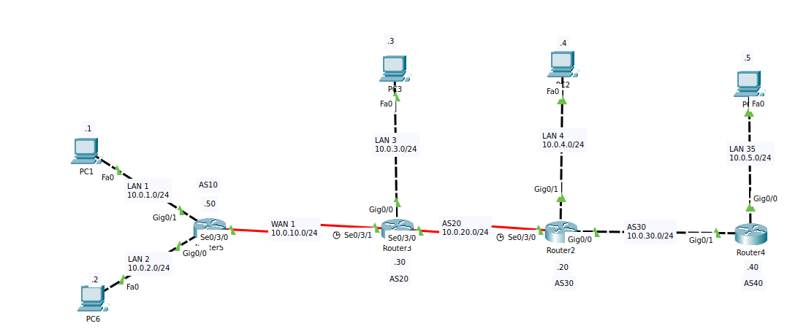

# Cenario



# Router 5

```bash
Router>enable
Router#conf t
```

### Configurando bgp

```bash
Router(config)#router bgp 10
Router(config-router)#neighbor 10.0.10.30 remote-as 20
Router(config-router)#network 10.0.2.0 mask 255.255.255.0
Router(config-router)#network 10.0.1.0 mask 255.255.255.0
Router(config-router)#exit
Router(config)#end
```

## configurando interface g0/1

```bash
Router#conf t
Router(config)#int g0/1
Router(config-if)#ip address 10.0.1.50 255.255.255.0
Router(config-if)#no shut
```

### configurando interface g0/0

```bash
Router(config-if)#int g0/0
Router(config-if)#ip address 10.0.2.50 255.255.255.0
Router(config-if)#no shut
```

### configurando interface s0/3/0

```bash
Router(config)#int s0/3/0
Router(config-if)#ip address 10.0.10.50 255.255.255.0
Router(config-if)#no shut
```

### salvando configuração

```bash
Router#copy running-config startup-config
```

# Router 3

```bash
Router>enable
Router#conf t
Router(config)#router bgp 20
Router(config-router)#neighbor 10.0.10.50 remote-as 10
Router(config-router)#neighbor 10.0.20.20 remote-as 30
Router(config-router)#network 10.0.3.0 mask 255.255.255.0
Router(config-router)#network 10.0.20.0 mask 255.255.255.0
Router(config-router)#network 10.0.10.0 mask 255.255.255.0
Router(config-router)#exit
Router(config)#end
```

### Configurando interface s0/3/1

```bash
Router(config)#int s0/3/1
Router(config-if)#ip address 10.0.10.30 255.255.255.0
Router(config-if)#no shut
```

### Configurando interface g0/0

```bash
Router(config)#int g0/0
Router(config-if)#ip address 10.0.3.30 255.255.255.0
Router(config-if)#no shut
```

### Configurndo s0/3/0

```bash
Router(config)#int s0/3/0
Router(config-if)#ip address 10.0.20.30 255.255.255.0
Router(config-if)#no shut
Router#copy running-config startup-config
```

# Router 2

```bash
Router(config)#router bgp 30
Router(config-router)#neighbor 10.0.20.30 remote-as 20
Router(config-router)#neighbor 10.0.30.40 remote-as 40
Router(config-router)#network 10.0.4.0 mask 255.255.255.0
Router(config-router)#network 10.0.20.0 mask 255.255.255.0
Router(config-router)#network 10.0.30.0 mask 255.255.255.0
Router(config-router)#exit

Router#copy running-config startup-config
```

# Router 4

```bash
Router(config)#router bgp 40
Router(config-router)#neighbor 10.0.30.20 remote-as 40
Router(config-router)#network 10.0.5.0 mask 255.255.255.0
Router(config-router)#network 10.0.30.0 mask 255.255.255.0
Router(config-router)#exit

Router#copy running-config startup-config
```
